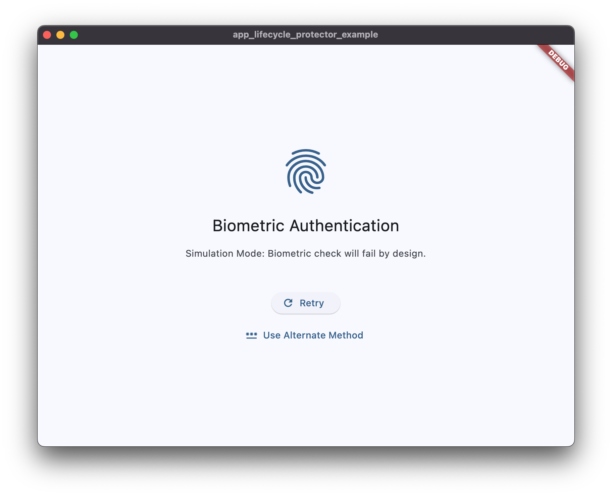
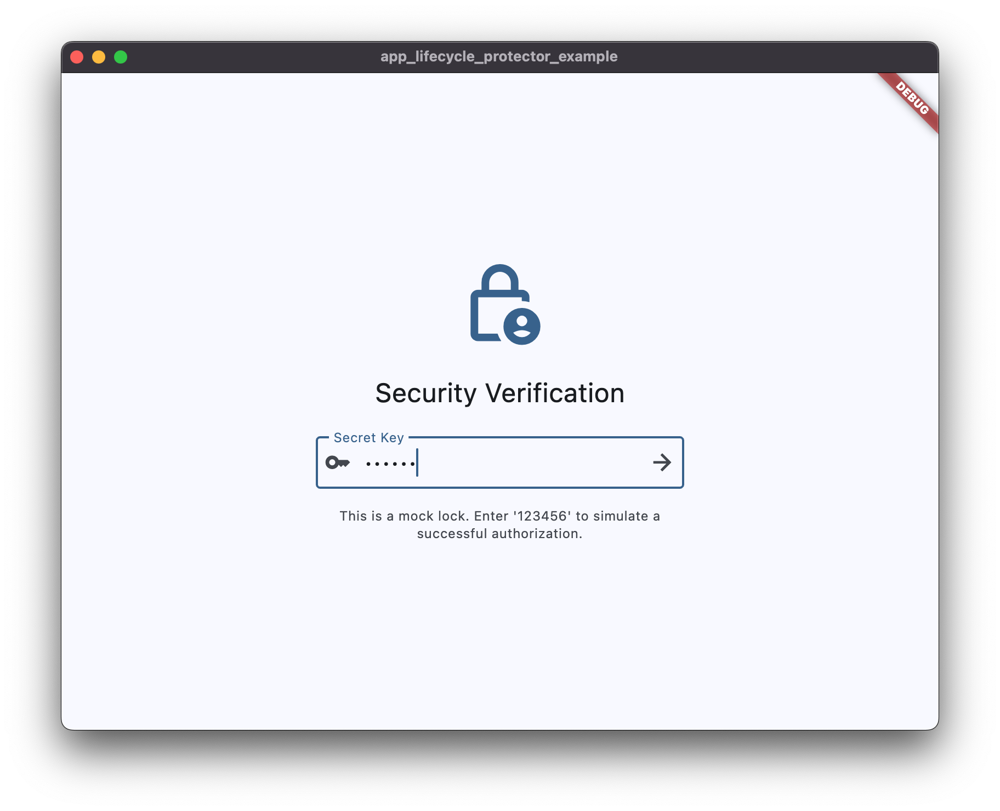
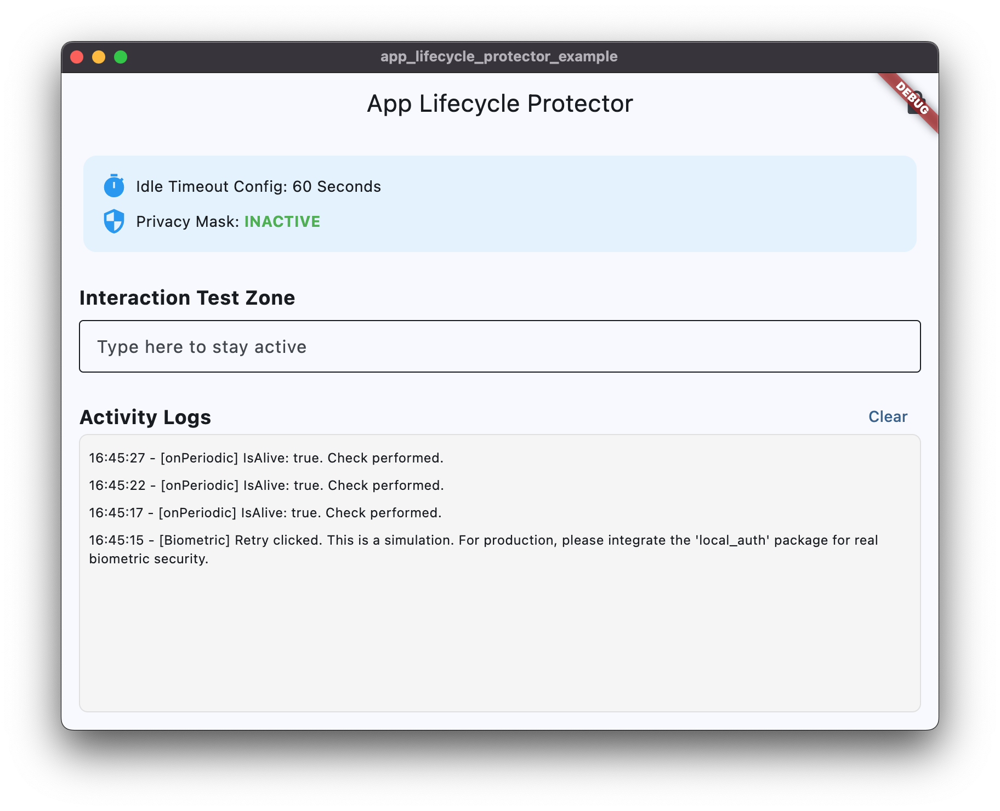

# App Lifecycle Protector

An **event-driven lifecycle scheduler** and business logic orchestrator for Flutter.

[](https://pub.dev/packages/app_lifecycle_protector)
[](https://opensource.org/licenses/MIT)

## 📸 Key Features & UI

| 1. Authorization on Launch | 2. Biometric Fallback | 3. Semantic Activity Tracking |
| :---: | :---: | :---: |
|  |  |  |
| Locks the app immediately upon startup. | Seamlessly transitions to passphrase. | Updates "alive" status on interaction. |

---

## 🌟 Why this package?

Flutter's built-in `AppLifecycleListener` is great for simple state changes, but it lacks high-level abstractions for complex background tasks and security. This package is built as an **Event-Driven Orchestrator**:

*   **Smart `onPeriodic` Polling**: A resource-friendly inspection loop that **runs only when the app is visible**. It automatically pauses in the background, preventing unnecessary CPU/battery drain—ideal for **network monitoring** or **scheduled API tasks**.
*   **Decoupled Logic**: Move complex lifecycle logic (like heartbeats, data refreshes, or security checks) out of your Widgets and into a clean, testable `AppLifecycleEvent` class.
*   **Semantic UI Overlays**: Effortlessly toggle "Mask" (privacy) and "Lock" (authorization) states across your entire application.

---

## 🚀 Quick Start

### 1. Define Your Logic (Business + Security)
Extend `AppLifecycleEvent` to handle periodic tasks and state changes in one place.

```dart
class MySmartHandler extends AppLifecycleEvent {
  final ScreenSecure screenSecure;
  MySmartHandler(this.screenSecure);

  @override
  void onPeriodic() {
    // This runs every 10s ONLY when the app is visible
    // 1. Business Logic: e.g., Check network or fetch notifications
    print("Performing resource-friendly API polling...");

    // 2. Security Logic: e.g., Idle timeout check
    if (!AppLifecycleScheduler.instance.isAlive()) {
      screenSecure.lock(); 
    }
  }
}
```

### 2. Initialize in the Root Widget
Initialize the scheduler in your root widget's `initState` to ensure it's ready before the UI builds.

```dart
@override
void initState() {
  super.initState();
  
  AppLifecycleScheduler.initialize(
    interval: const Duration(seconds: 10), // Inspection frequency
    event: MySmartHandler(screenSecure), // Your custom logic
  );

  // Set idle timeout (e.g., 5 minutes)
  AppLifecycleScheduler.instance.aliveDuration = const Duration(minutes: 5);
}
```

### 3. Wrap Your Application
Use `ScreenProtector` in your `MaterialApp.builder` to protect all routes.

```dart
MaterialApp(
  builder: (context, child) {
    return ScreenProtector(
      screenSecure: screenSecure,
      lockWidget: MyGlobalLockScreen(),
      child: child!, // Wraps the entire Navigator stack
    );
  },
  home: const MyHomePage(),
)
```

---

## 🛠️ Implementation Patterns

### Automatic App Lock on Launch
To ensure the app starts in a protected state, simply call `lock()` during initialization:

```dart
@override
void initState() {
  super.initState();
  // ... initialization ...
  screenSecure.lock(); // Immediate lock
}
```

### Privacy Masking
Automatically protect the UI snapshot in the multitasking view.

```dart
@override
void onPause() {
  screenSecure.mask(); // Shows maskWidget
}

@override
void onResume() {
  screenSecure.unmask(); // Hides maskWidget
}
```

---

## 📄 Documentation & Support
- **Core Documentation**: [English](doc/en/README.md) | [Chinese](doc/zh/README.md)
- **Implementation Guide**: [English](doc/en/EXAMPLE.md) | [Chinese](doc/zh/EXAMPLE.md)
- **Example Code**: [example/](example/)

### Support the Project 💖

If you find this package useful and would like to see it continue to improve and evolve, please consider showing your support:

- ⭐ **Star the Repo**: Give it a **Star** on GitHub or a **Like** on pub.dev.
- ☕ **Support the Developer (Global)**: Support via [GitHub Sponsors](https://github.com/sponsors/huanguan1978) or [Buy Me a Coffee](https://buymeacoffee.com/huanguan1978).
- 🐼 **Support via Ifdian (Mainland China)**: Users in China can also show support via [Ifdian](https://ifdian.net/a/huangaun1978).

*Thank you for your support, which is a vital boost that keeps me focused on the project's continuous iteration; because of you, more people can benefit from this tool much sooner.*

## License
MIT License.
